Contributions are welcome!

To get started with the project, please follow our [contributing guidelines](https://github.com/Rel1cx/eslint-react/blob/main/.github/CONTRIBUTING.md).

## Monorepo Structure

This section provides a reference to the repository structure and the relationships between different components.

```mermaid
flowchart TB
    %% Monorepo
    subgraph "Monorepo"
        %% Apps Subgraph
        subgraph "Apps"
            Website["Website"]:::apps
            Playground["Playground"]:::apps
        end

        %% Packages Subgraph
        subgraph "Packages"
            Core["Core Functionality"]:::packages
            Shared["Shared Utilities"]:::packages

            %% Utilities Subgraph
            subgraph "Utilities Modules"
                AST["AST Module"]:::utilities
                Eff["Eff Module"]:::utilities
                Var["Var Module"]:::utilities
            end

            %% ESLint Plugins Subgraph
            subgraph "ESLint Plugins"
                X["eslint-plugin-react-x"]:::plugins
                RSC["eslint-plugin-react-rsc"]:::plugins
                DOM["eslint-plugin-react-dom"]:::plugins
                WebAPI["eslint-plugin-react-web-api"]:::plugins
                NamingConvention["eslint-plugin-react-naming-convention"]:::plugins
                Aggregated["Aggregated Plugin (@eslint-react/eslint-plugin)"]:::plugins
            end
        end

        %% Scripts & Configurations
        Scripts["Scripts & Configurations"]:::external

        %% Tests
        Tests["Tests"]:::external
    end

    %% Relationships
    %% Plugins depend on Core and Shared
    Core -->|"dependency"| X
    Core -->|"dependency"| RSC
    Core -->|"dependency"| DOM
    Core -->|"dependency"| WebAPI
    Core -->|"dependency"| HooksExtra
    Core -->|"dependency"| NamingConvention

    Shared -->|"dependency"| X
    Shared -->|"dependency"| RSC
    Shared -->|"dependency"| DOM
    Shared -->|"dependency"| WebAPI
    Shared -->|"dependency"| HooksExtra
    Shared -->|"dependency"| NamingConvention

    %% Utilities used by Core and Plugins
    AST ---|"provides"| Core
    Eff ---|"provides"| Core
    Var ---|"provides"| Core

    AST ---|"provides"| X
    Eff ---|"provides"| X
    Var ---|"provides"| X

    %% Aggregation of Plugins
    X -->|"aggregated"| Aggregated
    RSC -->|"aggregated"| Aggregated
    DOM -->|"aggregated"| Aggregated
    WebAPI -->|"aggregated"| Aggregated
    HooksExtra -->|"aggregated"| Aggregated
    NamingConvention -->|"aggregated"| Aggregated

    %% Website Documentation uses Core and Shared docs
    Website -->|"docs"| Core
    Website -->|"docs"| Shared

    %% Scripts & CI automation interactions
    Scripts -->|"CI/CD"| Core
    Scripts -->|"CI/CD"| Shared
    Scripts -->|"CI/CD"| AST
    Scripts -->|"CI/CD"| Eff
    Scripts -->|"CI/CD"| Var
    Scripts -->|"CI/CD"| X
    Scripts -->|"CI/CD"| RSC
    Scripts -->|"CI/CD"| DOM
    Scripts -->|"CI/CD"| WebAPI
    Scripts -->|"CI/CD"| HooksExtra
    Scripts -->|"CI/CD"| NamingConvention
    Scripts -->|"CI/CD"| Aggregated
    Scripts -->|"CI/CD"| Tests

    %% Click Events
    click Website "https://github.com/rel1cx/eslint-react/tree/main/apps/website"
    click Playground "https://github.com/rel1cx/eslint-react/tree/main/apps/playground"
    click Core "https://github.com/rel1cx/eslint-react/tree/main/packages/core"
    click Shared "https://github.com/rel1cx/eslint-react/tree/main/packages/shared"
    click AST "https://github.com/rel1cx/eslint-react/tree/main/packages/utilities/ast"
    click Eff "https://github.com/rel1cx/eslint-react/tree/main/packages/utilities/eff"
    click Var "https://github.com/rel1cx/eslint-react/tree/main/packages/utilities/var"
    click X "https://github.com/rel1cx/eslint-react/tree/main/packages/plugins/eslint-plugin-react-x"
    click DOM "https://github.com/rel1cx/eslint-react/tree/main/packages/plugins/eslint-plugin-react-dom"
    click WebAPI "https://github.com/rel1cx/eslint-react/tree/main/packages/plugins/eslint-plugin-react-web-api"
    click NamingConvention "https://github.com/rel1cx/eslint-react/tree/main/packages/plugins/eslint-plugin-react-naming-convention"
    click Aggregated "https://github.com/rel1cx/eslint-react/tree/main/packages/plugins/eslint-plugin"
    click Scripts "https://github.com/rel1cx/eslint-react/tree/main/scripts"
    click Tests "https://github.com/rel1cx/eslint-react/tree/main/test"

    %% Styles
    classDef apps fill:#f9e79f,stroke:#7d6608,stroke-width:2px;
    classDef packages fill:#aed6f1,stroke:#1b4f72,stroke-width:2px;
    classDef utilities fill:#a9dfbf,stroke:#145a32,stroke-width:2px;
    classDef plugins fill:#f5b7b1,stroke:#78281f,stroke-width:2px;
    classDef external fill:#d2b4de,stroke:#4a235a,stroke-width:2px;
```

## Packages Summary

This section provides a summary of the packages in the monorepo.

### Local Packages

- `.pkgs/configs`: Workspace config bases

### Internal Packages

- **Utilities**
  - `packages/utilities/eff`: JavaScript and TypeScript utilities (previously some re-exports of the `effect` library)
  - `packages/utilities/ast`: TSESTree AST utility module for static analysis
  - `packages/utilities/var`: TSESTree AST utility module for static analysis of variables
- **Core & Shared**
  - `packages/core`: Utility module for static analysis of React core APIs and patterns
  - `packages/shared`: Shared constants, types and functions

### Public Packages

- **ESLint Plugins**
  - `packages/plugins/eslint-plugin-react-x`: Core React rules
  - `packages/plugins/eslint-plugin-react-rsc`: React Server Components rules
  - `packages/plugins/eslint-plugin-react-dom`: React DOM rules
  - `packages/plugins/eslint-plugin-react-web-api`: Web API interaction rules
  - `packages/plugins/eslint-plugin-react-naming-convention`: Naming convention rules
  - `packages/plugins/eslint-plugin-react-debug`: Debugging rules for inspecting React patterns in code
  - `packages/plugins/eslint-plugin`: A unified plugin that combines all individual plugins into one

### Documentation

- `apps/website`: Documentation website
- `apps/playground`: Interactive playground (WIP)

## Further Reading

- [Core Architecture](https://deepwiki.com/Rel1cx/eslint-react/2-core-architecture)
- [Component and Hook Detection](https://deepwiki.com/Rel1cx/eslint-react/2.1-component-and-hook-detection)
