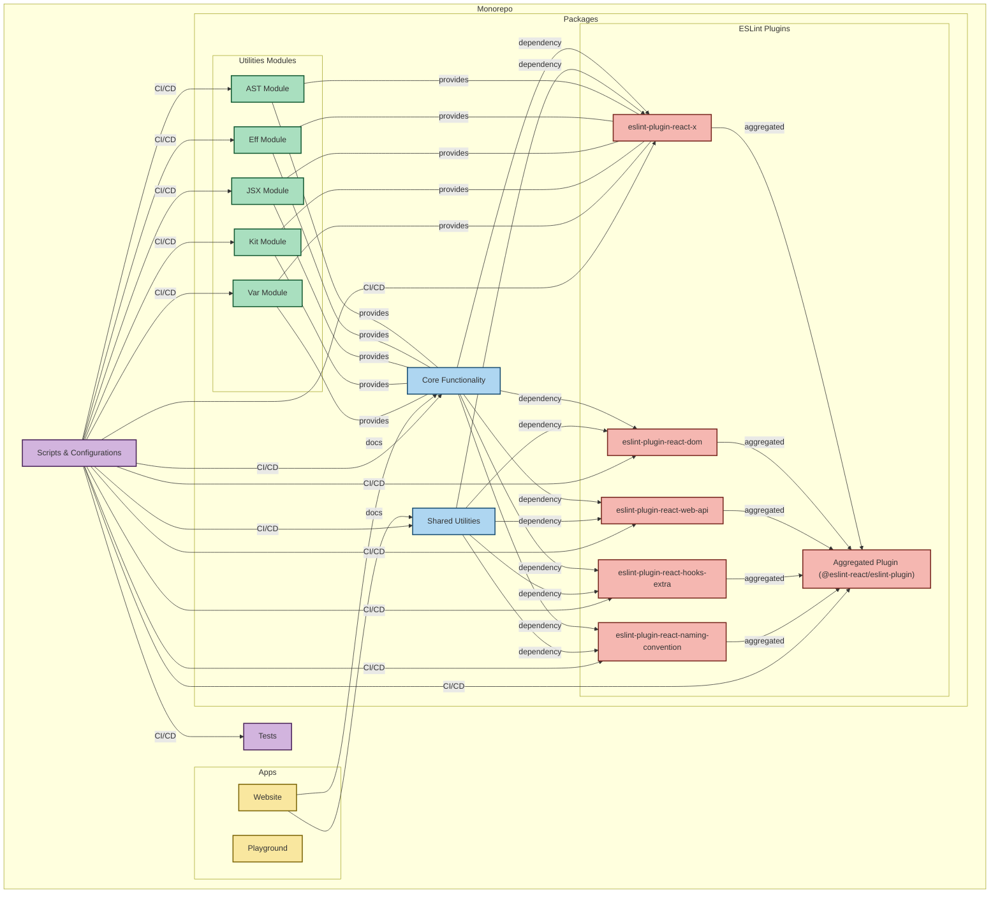

Contributions are welcome!

Please follow our [contributing guidelines](https://github.com/Rel1cx/eslint-react/blob/main/.github/CONTRIBUTING.md).

## Repository Structure

### Local Packages

- `.pkgs/configs`: Workspace config bases
- `.pkgs/eslint-plugin-local`: Internal workspace ESLint plugin

### Internal Packages

- **Utilities**
  - `packages/utilities/eff`: JavaScript and TypeScript utilities (previously some re-exports of the `effect` library)
  - `packages/utilities/ast`: TSESTree AST utility module for static analysis
  - `packages/utilities/var`: TSESTree AST utility module for static analysis of variables
  - `packages/utilities/jsx`: TSESTree AST utility module for static analysis of JSX
  - `packages/utilities/kit`: ESLint React's Plugin Kit for building plugins and rules
- **Core & Shared**
  - `packages/core`: Utility module for static analysis of React core APIs and patterns
  - `packages/shared`: Shared constants, types and functions

### Public Packages

- **ESLint Plugins**
  - `eslint-plugin-react-x`: Core React rules
  - `eslint-plugin-react-dom`: React DOM rules
  - `eslint-plugin-react-web-api`: Web API interaction rules
  - `eslint-plugin-react-hooks-extra`: Extra React Hooks rules
  - `eslint-plugin-react-naming-convention`: Naming convention rules
  - `eslint-plugin-react-debug`: Debugging rules for inspecting React patterns in code
  - `eslint-plugin`: Main plugin combining all rules and presets from the above packages

### Documentation

- `apps/website`: Documentation website
- `apps/playground`: Interactive playground (WIP)

## Repository Structure Diagram

