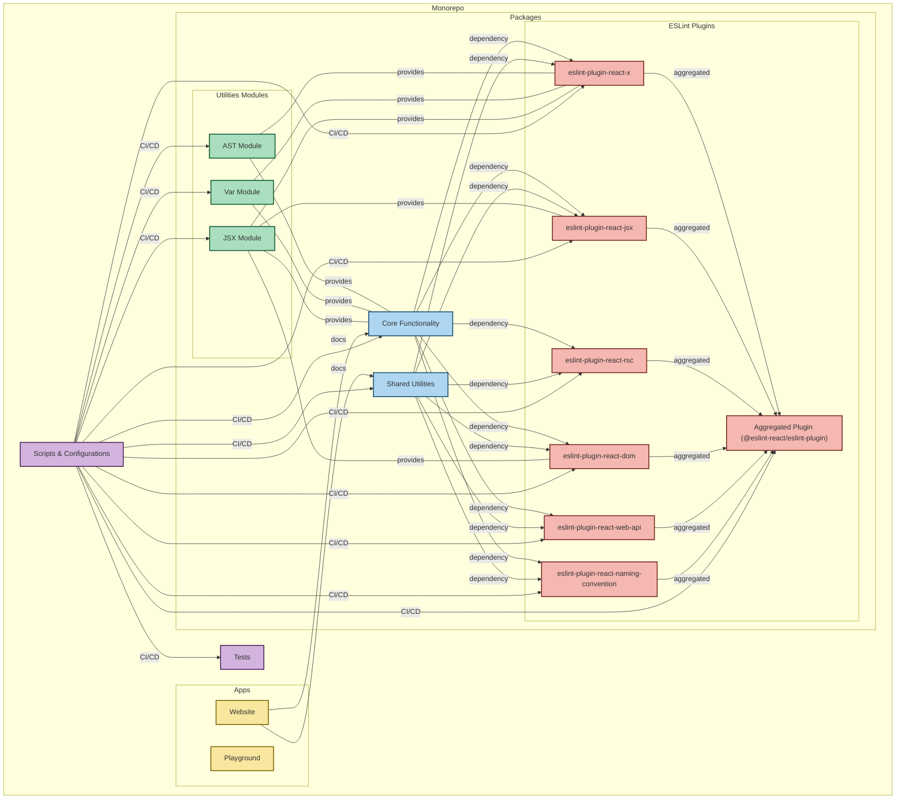

Contributions are welcome!

To get started with the project, please follow our [contributing guidelines](https://github.com/Rel1cx/eslint-react/blob/main/.github/CONTRIBUTING.md).

## Monorepo Structure

This section provides a reference to the repository structure and the relationships between different components.

```mermaid
flowchart TB
    %% Monorepo
    subgraph "Monorepo"
        %% Apps Subgraph
        subgraph "Apps"
            Website["Website"]:::apps
            Playground["Playground"]:::apps
        end

        %% Packages Subgraph
        subgraph "Packages"
            Core["Core Functionality"]:::packages
            Shared["Shared Utilities"]:::packages

            %% Utilities Subgraph
            subgraph "Utilities Modules"
                AST["AST Module"]:::utilities
                Var["Var Module"]:::utilities
                JSX["JSX Module"]:::utilities
            end

            %% ESLint Plugins Subgraph
            subgraph "ESLint Plugins"
                ReactX["eslint-plugin-react-x"]:::plugins
                ReactJSX["eslint-plugin-react-jsx"]:::plugins
                ReactRSC["eslint-plugin-react-rsc"]:::plugins
                ReactDOM["eslint-plugin-react-dom"]:::plugins
                ReactWebAPI["eslint-plugin-react-web-api"]:::plugins
                ReactNamingConvention["eslint-plugin-react-naming-convention"]:::plugins
                ReactAggregated["Aggregated Plugin (@eslint-react/eslint-plugin)"]:::plugins
            end
        end

        %% Scripts & Configurations
        Scripts["Scripts & Configurations"]:::external

        %% Tests
        Tests["Tests"]:::external
    end

    %% Relationships
    %% Plugins depend on Core and Shared
    Core -->|"dependency"| ReactX
    Core -->|"dependency"| ReactJSX
    Core -->|"dependency"| ReactRSC
    Core -->|"dependency"| ReactDOM
    Core -->|"dependency"| ReactWebAPI
    Core -->|"dependency"| ReactNamingConvention

    Shared -->|"dependency"| ReactX
    Shared -->|"dependency"| ReactJSX
    Shared -->|"dependency"| ReactRSC
    Shared -->|"dependency"| ReactDOM
    Shared -->|"dependency"| ReactWebAPI
    Shared -->|"dependency"| ReactNamingConvention

    %% Utilities used by Core and Plugins
    AST ---|"provides"| Core
    Var ---|"provides"| Core
    JSX ---|"provides"| Core

    AST ---|"provides"| ReactX
    Var ---|"provides"| ReactX
    JSX ---|"provides"| ReactX
    JSX ---|"provides"| ReactDOM
    JSX ---|"provides"| ReactJSX

    %% Aggregation of Plugins
    ReactX -->|"aggregated"| ReactAggregated
    ReactJSX -->|"aggregated"| ReactAggregated
    ReactRSC -->|"aggregated"| ReactAggregated
    ReactDOM -->|"aggregated"| ReactAggregated
    ReactWebAPI -->|"aggregated"| ReactAggregated
    ReactNamingConvention -->|"aggregated"| ReactAggregated

    %% Website Documentation uses Core and Shared docs
    Website -->|"docs"| Core
    Website -->|"docs"| Shared

    %% Scripts & CI automation interactions
    Scripts -->|"CI/CD"| Core
    Scripts -->|"CI/CD"| Shared
    Scripts -->|"CI/CD"| AST
    Scripts -->|"CI/CD"| Var
    Scripts -->|"CI/CD"| JSX
    Scripts -->|"CI/CD"| ReactX
    Scripts -->|"CI/CD"| ReactJSX
    Scripts -->|"CI/CD"| ReactRSC
    Scripts -->|"CI/CD"| ReactDOM
    Scripts -->|"CI/CD"| ReactWebAPI
    Scripts -->|"CI/CD"| ReactNamingConvention
    Scripts -->|"CI/CD"| ReactAggregated
    Scripts -->|"CI/CD"| Tests

    %% Click Events
    click Website "https://github.com/rel1cx/eslint-react/tree/main/apps/website"
    click Playground "https://github.com/rel1cx/eslint-react/tree/main/apps/playground"
    click Core "https://github.com/rel1cx/eslint-react/tree/main/packages/core"
    click Shared "https://github.com/rel1cx/eslint-react/tree/main/packages/shared"
    click AST "https://github.com/rel1cx/eslint-react/tree/main/packages/ast"
    click Var "https://github.com/rel1cx/eslint-react/tree/main/packages/var"
    click JSX "https://github.com/rel1cx/eslint-react/tree/main/packages/jsx"
    click ReactX "https://github.com/rel1cx/eslint-react/tree/main/plugins/eslint-plugin-react-x"
    click ReactJSX "https://github.com/rel1cx/eslint-react/tree/main/plugins/eslint-plugin-react-jsx"
    click ReactRSC "https://github.com/rel1cx/eslint-react/tree/main/plugins/eslint-plugin-react-rsc"
    click ReactDOM "https://github.com/rel1cx/eslint-react/tree/main/plugins/eslint-plugin-react-dom"
    click ReactWebAPI "https://github.com/rel1cx/eslint-react/tree/main/plugins/eslint-plugin-react-web-api"
    click ReactNamingConvention "https://github.com/rel1cx/eslint-react/tree/main/plugins/eslint-plugin-react-naming-convention"
    click ReactAggregated "https://github.com/rel1cx/eslint-react/tree/main/plugins/eslint-plugin"
    click Scripts "https://github.com/rel1cx/eslint-react/tree/main/scripts"
    click Tests "https://github.com/rel1cx/eslint-react/tree/main/test"

    %% Styles
    classDef apps fill:#f9e79f,stroke:#7d6608,stroke-width:2px;
    classDef packages fill:#aed6f1,stroke:#1b4f72,stroke-width:2px;
    classDef utilities fill:#a9dfbf,stroke:#145a32,stroke-width:2px;
    classDef plugins fill:#f5b7b1,stroke:#78281f,stroke-width:2px;
    classDef external fill:#d2b4de,stroke:#4a235a,stroke-width:2px;
```

## Packages Summary

This section provides a summary of the packages in the monorepo.

### Local Packages

- [`.pkgs/configs`](https://github.com/Rel1cx/eslint-react/tree/main/.pkgs/configs): Workspace config bases
- [`.pkgs/eff`](https://github.com/Rel1cx/eslint-react/tree/main/.pkgs/eff): JavaScript and TypeScript utilities

### Internal Packages

- **Utilities**
  - [`packages/ast`](https://github.com/Rel1cx/eslint-react/tree/main/packages/ast): TSESTree AST utility module for static analysis
  - [`packages/var`](https://github.com/Rel1cx/eslint-react/tree/main/packages/var): TSESTree AST utility module for static analysis of variables
  - [`packages/jsx`](https://github.com/Rel1cx/eslint-react/tree/main/packages/jsx): TSESTree JSX utility module for static analysis of JSX patterns
- **Core & Shared**
  - [`packages/core`](https://github.com/Rel1cx/eslint-react/tree/main/packages/core): Utility module for static analysis of React core APIs and patterns
  - [`packages/shared`](https://github.com/Rel1cx/eslint-react/tree/main/packages/shared): Shared constants, types and functions

### Public Packages

- **Utilities**
  - [`packages/kit`](https://github.com/Rel1cx/eslint-react/tree/main/packages/kit): Utility module for building custom React rules with JavaScript functions
- **ESLint Plugins**
  - [`plugins/eslint-plugin-react-x`](https://github.com/Rel1cx/eslint-react/tree/main/plugins/eslint-plugin-react-x): Core React rules
  - [`plugins/eslint-plugin-react-jsx`](https://github.com/Rel1cx/eslint-react/tree/main/plugins/eslint-plugin-react-jsx): React Flavored JSX rules
  - [`plugins/eslint-plugin-react-rsc`](https://github.com/Rel1cx/eslint-react/tree/main/plugins/eslint-plugin-react-rsc): React Server Components rules
  - [`plugins/eslint-plugin-react-dom`](https://github.com/Rel1cx/eslint-react/tree/main/plugins/eslint-plugin-react-dom): React DOM rules
  - [`plugins/eslint-plugin-react-web-api`](https://github.com/Rel1cx/eslint-react/tree/main/plugins/eslint-plugin-react-web-api): Web API interaction rules
  - [`plugins/eslint-plugin-react-naming-convention`](https://github.com/Rel1cx/eslint-react/tree/main/plugins/eslint-plugin-react-naming-convention): Naming convention rules
  - [`plugins/eslint-plugin-react-debug`](https://github.com/Rel1cx/eslint-react/tree/main/plugins/eslint-plugin-react-debug): Debugging rules for inspecting React patterns in code
  - [`plugins/eslint-plugin`](https://github.com/Rel1cx/eslint-react/tree/main/plugins/eslint-plugin) (npm: `@eslint-react/eslint-plugin`): A unified plugin that combines all individual plugins into one

### Documentation

- [`apps/website`](https://github.com/Rel1cx/eslint-react/tree/main/apps/website): Documentation website
- [`apps/playground`](https://github.com/Rel1cx/eslint-react/tree/main/apps/playground): Interactive playground (placeholder)
